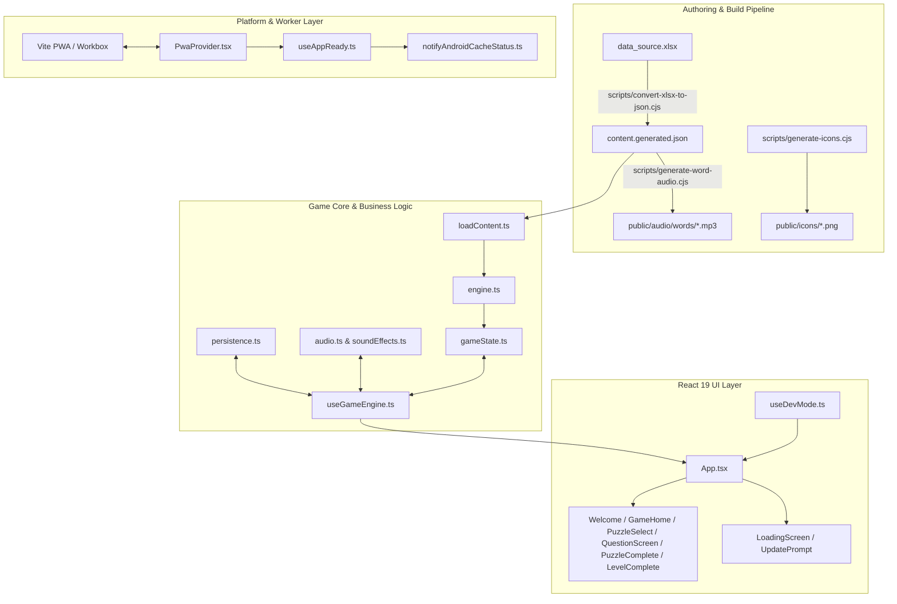
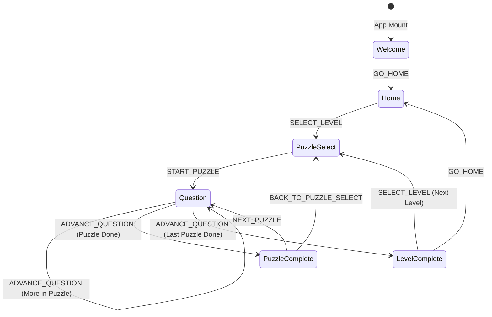
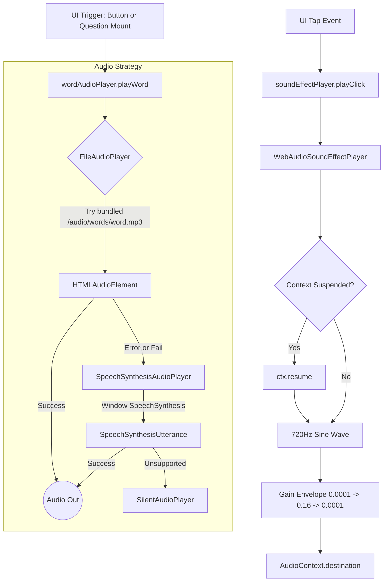

# Forest Spelling Adventure — In-Depth Technical & Architecture Specification

## 1. Executive Summary & Product Architecture

**Forest Spelling Adventure** (`speeling-game-2`) is an offline-first, phonics-based educational web application and Progressive Web App (PWA) tailored for early readers and English language learners (kindergarten to early elementary / ESL). The learner navigates phonics-themed forest levels guided by an expressive cartoon fox mascot named **Fern**, listening to spoken words and identifying correct spellings from four carefully crafted choices.

### Key Pedagogy & Design Principles
1. **Phonetic Foils over Random Distractors**: Rather than presenting random misspellings, wrong choices ("foils") specifically target common phonological confusions (e.g., initial consonant, final consonant, vowel substitution, digraphs, silent-e, L1-language transfer errors like Spanish /r/-/l/ or /th/).
2. **Encouraging Mastery Loop**: Mistakes never block progress or yield 0-star scores. Completing a puzzle always grants at least 1 star. A flawless run earns 3 stars, while 1–3 mistakes earn 2 stars. Replaying keeps the best score.
3. **Resilient Offline-First & Hybrid Shell Execution**: The application is fully bundled and precached with Workbox. It operates seamlessly in sandboxed Android WebViews, desktop browsers, or low-connectivity environments, featuring a multi-tiered audio engine and bidirectional native Android cache-status handshakes.
4. **Deterministic Separation of Concerns**: Game rules, state reduction, audio synthesis, persistence, and UI rendering are decoupled behind explicit interfaces and pure functions.



---

## 2. Technology Stack & Tooling

| Dimension | Technology | Rationale & Configuration |
|---|---|---|
| **Core Framework** | React 19 (`react`, `react-dom`) | Modern component lifecycle, hooks, and clean unopinionated rendering. |
| **Language** | TypeScript 6 (`~6.0.2`) | Strict typing across state, actions, content schema, and persistence. |
| **Bundler & Build Tool** | Vite 8 (`vite`, `@vitejs/plugin-react`) | Instant HMR in development, fast ESM production bundling, static asset rollups. |
| **Styling Architecture** | Vanilla CSS + CSS Modules (`*.module.css`) | Zero-runtime CSS isolation, CSS custom properties (`theme.css`), high frame-rate keyframe animations, no heavy utility framework overhead. |
| **PWA & Offline** | `vite-plugin-pwa` + Workbox | Full asset precaching (`js, css, html, svg, png, woff2, mp3`), clientsClaim, runtime caching for Google Fonts, prompt-based service worker upgrades. |
| **Test Runner & Environment** | Vitest 5 (`vitest`, `jsdom`, `@testing-library/react`) | Fast in-memory unit and integration tests with deterministic mocks for storage and random sources. |
| **Linter** | Oxlint (`^1.81.0`) | High-performance Rust-based JavaScript/TypeScript linter. |
| **Audio Generation Tooling** | `msedge-tts` | CLI synthesis of clear neural voice audio (`en-US-JennyNeural`) for all 200 vocabulary words. |
| **Spreadsheet Pipeline** | `xlsx` (SheetJS) | Automated conversion from authoring spreadsheets to JSON content. |
| **Deployment Target** | Cloudflare Pages (`wrangler pages deploy dist`) | Edge CDN deployment with global low-latency static hosting. |

---

## 3. Data Architecture & Pipeline

### 3.1 Content Ingestion (`data_source.xlsx`)
All curriculum content is authored in `data_source.xlsx`, consisting of three worksheets:
1. `WordList`: Rows containing `level`, `item`, `sequence`, `skill`, `target`, `foil1`, `type1`, `foil2`, `type2`, `foil3`, `type3`.
2. `LevelGuide`: Rows defining each `level`, its pedagogical `skill` description, and expected `wordCount`.
3. `FoilCodebook`: Maps 2-to-6 character foil codes (e.g. `IC`, `V`, `L1-RL`) to human-readable linguistics definitions.

### 3.2 Offline Build Scripts (`scripts/`)

#### 1. `scripts/convert-xlsx-to-json.cjs`
Converts `data_source.xlsx` into `src/data/content.generated.json`.
- `readSheetRows(workbook, sheetName)`: Extracts rows from a named sheet as a 2D matrix (`header: 1`) using SheetJS `sheet_to_json`. Throws if the sheet is missing.
- `isBlankRow(row)`: Detects empty or null spreadsheet rows to skip trailing blanks.
- `buildLevels(workbook)`: Parses `LevelGuide`, casts level and word count numbers, strips strings, and returns `LevelInfo[]` sorted by level number.
- `buildFoilTypeLabels(workbook)`: Reads `FoilCodebook` and maps codes (`code`) to descriptions (`foilType`).
- `buildQuestions(workbook)`: Iterates `WordList`. Validates that required fields are present; discards invalid rows with warnings; normalizes targets and foils to lowercase; creates `Question[]`.
- `main()`: Orchestrates workbook reading, invokes parsers, creates target directory, and writes formatted JSON to `src/data/content.generated.json`.

#### 2. `scripts/generate-word-audio.cjs`
Generates bundled, static MP3 files for each unique target word to guarantee reliable playback without relying on browser speech APIs.
- `getUniqueTargetWords()`: Parses `content.generated.json`, extracts unique `target` words, trims, lowercases, and sorts alphabetically.
- `streamToBuffer(stream)`: Collects incoming chunks from an audio stream into a single Node.js `Buffer`.
- `main()`: Connects to Microsoft Edge's neural TTS backend (`MsEdgeTTS`) configured with voice `en-US-JennyNeural` and rate `-10%`. Iterates words, checks if `<word>.mp3` already exists in `public/audio/words/` (skips unless `--force` is passed), converts speech stream to MP3, and saves to disk.

#### 3. `scripts/generate-icons.cjs`
Zero-dependency, programmatic icon generator for PWA manifests.
- `distToSegment(px, py, ax, ay, bx, by)`: Calculates point-to-line-segment Euclidean distance for rendering leaf veins.
- `renderIcon(size, { maskable })`: Programmatically draws an RGBA pixel buffer representing the green leaf icon, adapting background radius and scale for standard circular vs. maskable square boundaries.
- `crc32Chunk(typeAndData)`: Computes CRC32 checksums for PNG chunks using Node's native `zlib.crc32`.
- `chunk(type, data)`: Assembles PNG binary chunks (`length + type + data + crc`).
- `encodePNG(size, rgba)`: Encodes raw scanline bytes into an 8-bit RGBA PNG binary image using deflate compression (`zlib.deflateSync`).
- `writeIcon(fileName, size, options)`: Renders and saves `icon-192.png`, `icon-512.png`, and `maskable-icon-512.png`.

---

## 4. Runtime Content Management (`src/data/`)

### 4.1 Data Types (`src/data/types.ts`)
- `Foil`: `{ word: string; type: string }` representing an incorrect answer and its diagnostic code.
- `Question`: `{ level: number; item: number; sequence: number; skill: string; target: string; foils: Foil[] }`.
- `LevelInfo`: `{ level: number; skill: string; wordCount: number }`.
- `GameContent`: `{ levels: LevelInfo[]; foilTypeLabels: Record<string, string>; questions: Question[] }`.
- `AnswerChoice`: `{ word: string; isCorrect: boolean; type?: string }`.

### 4.2 Content Loader & Validator (`src/data/loadContent.ts`)
- `normalizeQuestion(value: unknown): Question | null`: Defensive runtime validation. Verifies types for level, target, and foils array. Cleans whitespace and normalizes to lowercase. Discards invalid items rather than throwing runtime exceptions.
- `normalizeLevel(value: unknown): LevelInfo | null`: Verifies and normalizes level number, skill title, and word count.
- `buildContent(): GameContent`: Parses raw JSON import, validates and sorts questions by level and sequence. If `LevelGuide` was missing rows, it derives level entries directly from question data.
- `getGameContent(): GameContent`: Returns a cached singleton instance of validated `GameContent`.
- `getLevelList(): LevelInfo[]`: Returns all levels sorted in ascending order.
- `getQuestionsForLevel(level: number): Question[]`: Filters all questions belonging to a specific level, ordered by sequence.
- `getFoilTypeLabel(code: string): string`: Translates a technical foil code into a descriptive label.
- `getPuzzlesForLevel(level: number, puzzleCount?: number): Question[][]`: Partitions level questions into chunks (puzzles) using `chunkIntoPuzzles`.
- `getPuzzleCountForLevel(level: number, puzzleCount?: number): number`: Returns the total number of puzzles present in a given level.

---

## 5. Pure Game Rules Engine (`src/game/engine.ts`)

The rules engine is 100% pure, side-effect-free, and platform-agnostic (zero dependencies on React, the DOM, or browser storage).

### 5.1 Functions and Algorithms

#### `shuffle<T>(items: T[], random?: RandomSource): T[]`
Implements the Fisher-Yates (Knuth) shuffle algorithm.
- Operates immutably by creating a shallow copy (`[...items]`).
- Iterates from `n - 1` down to 1, swapping elements with an index chosen by `random()`.
- Accepts an optional injectable `RandomSource = () => number` allowing deterministic test verification.

#### `generateChoices(question: Question, random?: RandomSource): AnswerChoice[]`
Builds the 4 options shown on the question screen.
- Combines `{ word: question.target, isCorrect: true }` with the question's 3 foils `{ word: foil.word, isCorrect: false, type: foil.type }`.
- Runs `shuffle()` over the 4 choices so the correct answer's button slot varies unpredictably.

#### `isCorrectAnswer(question: Question, selectedWord: string): boolean`
Performs case-insensitive, whitespace-trimmed equality checking between `selectedWord` and `question.target`.

#### `findFoilByWord(question: Question, selectedWord: string): Foil | undefined`
Searches `question.foils` to identify the chosen foil, allowing retrieval of its diagnostic error type.

#### `getHintForFoilType(foilType: string | undefined): string`
Maps foil error codes to pedagogical, child-friendly feedback:
- `IC` -> *"Listen to the first sound."*
- `FC` -> *"Listen to the last sound."*
- `V` -> *"Listen to the middle sound."*
- `DIG` -> *"Listen closely to that sound — two letters team up to make it."*
- `TR` -> *"Check the order of the letters."*
- `L1-RL` -> *"Listen closely to the first sound — is it r or l?"*
- `L1-TH` -> *"Listen closely to the 'th' sound."*
- Fallback -> *"Listen again and try once more."*

#### `getFeedbackHint(question: Question, selectedWord: string): string`
Combines `findFoilByWord` and `getHintForFoilType` to return the appropriate coaching tip for the clicked foil.

#### `calculateProgress(completedCount: number, total: number): ProgressInfo`
Safely clamps values to produce UI progress information:
- `current`: bounded between 0 and `total`.
- `total`: clamped to $\ge 0$.
- `fraction`: floating point ratio between 0.0 and 1.0 (or 0 if total is 0).
- `label`: formatted string, e.g. `"3 / 10"`.

#### `isLevelComplete(completedCount: number, total: number): boolean`
Returns `true` if `total > 0` and `completedCount >= total`.

#### `chunkIntoPuzzles<T>(items: T[], puzzleCount = 5): T[][]`
Partitions a list of items into balanced subsets.
- If `items.length === 0`, returns `[]`.
- Caps effective puzzle count to `min(puzzleCount, items.length)`.
- Calculates `base = Math.floor(length / count)` and `remainder = length % count`.
- Distributes remainder items 1-by-1 to the earliest puzzles, guaranteeing maximum balance (e.g. 21 items over 5 puzzles become sizes `[5, 4, 4, 4, 4]`).

#### `isPuzzleUnlocked(puzzleNumber: number, completedPuzzleNumbers: number[], devMode = false): boolean`
Puzzle 1 is unlocked by default. Any puzzle $N > 1$ is unlocked if and only if puzzle $N - 1$ exists in `completedPuzzleNumbers`. If `devMode` is `true`, always returns `true` regardless of progress (see §9.2, Dev Mode, below).

#### `starsForMistakes(mistakes: number): number`
Calculates puzzle star performance:
- $\le 0$ mistakes: **3 Stars** (Flawless)
- $1 \text{ to } 3$ mistakes: **2 Stars** (Good effort)
- $\ge 4$ mistakes: **1 Star** (Completion award; no 0-star state exists)

#### `computeLevelStatuses(levelNumbers, completedPuzzlesByLevel, puzzleCountByLevel, devMode = false): Map<number, LevelStatus>`
Computes each level's status (`'locked'`, `'available'`, or `'completed'`):
- Evaluates levels in sequential order.
- Level 1 is always `'available'` unless completed.
- Level $K$ is `'completed'` if all its puzzles are done.
- Level $K$ is `'available'` if level $K - 1$ was `'completed'`, **or** if `devMode` is `true`.
- Level $K$ is `'locked'` if level $K - 1$ has uncompleted puzzles and `devMode` is `false`.

---

## 6. State Management & Reducer (`src/game/gameState.ts`)

State management uses a pure reducer without external dependencies.



### 6.1 State Data Model (`GameState`)
```typescript
interface GameState {
  screen: 'welcome' | 'home' | 'puzzleSelect' | 'question' | 'puzzleComplete' | 'levelComplete';
  levelNumber: number | null;
  levelSkill: string;
  puzzles: Question[][];
  puzzleNumber: number; // 1-indexed
  questions: Question[];
  questionIndex: number;
  choices: AnswerChoice[];
  selectedWord: string | null;
  status: 'unanswered' | 'correct' | 'incorrect';
  incorrectWords: string[];
  attempts: number;
  puzzleMistakes: number;
  puzzleProgress: Record<number, number[]>; // level -> completed puzzle numbers
  puzzleStars: Record<number, Record<number, number>>; // level -> puzzle -> best stars
}
```

### 6.2 Reducer Actions & Transitions (`gameReducer`)
- `SET_PUZZLE_PROGRESS`: Updates `puzzleProgress` from storage.
- `SET_PUZZLE_STARS`: Updates `puzzleStars` high-score record.
- `SELECT_LEVEL`: Transitions to `'puzzleSelect'`, sets `levelNumber`, `levelSkill`, and stores partitioned `puzzles`.
- `START_PUZZLE`: Calls `loadPuzzle()`, sets active puzzle questions, resets question index to 0, calls `generateChoices()`, resets `puzzleMistakes`, and sets screen to `'question'`.
- `SELECT_ANSWER`:
  - If status is already `'correct'`, ignores redundant clicks.
  - Checks if chosen word matches target.
  - If correct: sets `status = 'correct'`.
  - If incorrect: sets `status = 'incorrect'`, increments `attempts`, increments `puzzleMistakes`, and appends the word to `incorrectWords`.
- `ADVANCE_QUESTION`:
  - Increments `questionIndex`.
  - If all questions in puzzle are finished: transitions to `'levelComplete'` if this was the final puzzle of the level, or `'puzzleComplete'` otherwise.
  - If questions remain: loads next question, calls `generateChoices()`, resets answer status to `'unanswered'`.
- `NEXT_PUZZLE`: Invokes `loadPuzzle(state, state.puzzleNumber + 1)`.
- `BACK_TO_PUZZLE_SELECT`: Returns to `'puzzleSelect'`, resetting active question state.
- `GO_HOME`: Resets to `initialGameState` while retaining progress and star history; sets screen to `'home'`.

---

## 7. Persistence Subsystem (`src/game/persistence.ts`)

Provides resilient storage for puzzle completions and star ratings with validation, error guarding, and in-memory fallbacks.

### 7.1 Architecture & Interfaces
- `STORAGE_KEY`: `'spelling-game:puzzle-progress'`
- `STARS_KEY`: `'spelling-game:puzzle-stars'`
- `ProgressStore` interface:
  - `getProgress(): PuzzleProgress`
  - `markPuzzleComplete(level: number, puzzleNumber: number): void`
  - `getStars(): PuzzleStars`
  - `markPuzzleStars(level: number, puzzleNumber: number, stars: number): void`

### 7.2 Implementations
1. `LocalStorageProgressStore`:
   - Safely parses JSON with `isValidProgress` and `isValidStars` type guards.
   - Enforces monotonic star updates via `recordPuzzleStars(existing, level, puzzle, newStars)`: `Math.max(previousBest, newStars)`.
   - Protects against storage quota exceptions or private-browsing restrictions with try/catch blocks.
2. `InMemoryProgressStore`:
   - Implements identical interface in memory for environments where `localStorage` is disabled or fails quota checks.
3. `createDefaultStore()`:
   - Tests availability using `hasWorkingLocalStorage()` (writes and removes a test key). Selects `LocalStorageProgressStore` or falls back to `InMemoryProgressStore`. Exported as singleton `progressStore`.

---

## 8. Audio Architecture (`src/game/audio.ts` & `src/game/soundEffects.ts`)



### 8.1 Word Audio Player (`src/game/audio.ts`)
- `WordAudioPlayer` interface: `playWord(word: string): void`, `stop(): void`, `isSupported(): boolean`.
- `FileAudioPlayer`:
  - First-line strategy for production. Plays pre-generated MP3 files from `/audio/words/<word>.mp3`.
  - Operates reliably inside Android WebViews and is precached by Workbox for offline use.
  - Attaches `error` listeners to `HTMLAudioElement` and catches `.play()` promise rejections, immediately falling back to `this.fallback.playWord(word)`.
- `SpeechSynthesisAudioPlayer`:
  - Browser TTS fallback utilizing `window.speechSynthesis`.
  - Configures `SpeechSynthesisUtterance` with `rate = 0.8`, `lang = 'en-US'`.
- `SilentAudioPlayer`:
  - Harmless no-op null object for headless or unsupported environments.
- `createDefaultPlayer()`:
  - Chains `FileAudioPlayer` -> `SpeechSynthesisAudioPlayer` -> `SilentAudioPlayer`. Exported as singleton `wordAudioPlayer`.

### 8.2 UI Sound Effects (`src/game/soundEffects.ts`)
- `SoundEffectPlayer` interface: `playClick(): void`, `isSupported(): boolean`.
- `WebAudioSoundEffectPlayer`:
  - Creates a lightweight, zero-network tap sound on user interaction.
  - Retrieves `AudioContext` or `webkitAudioContext`.
  - Handles browser audio suspension policies: resumes suspended contexts synchronously inside click events.
  - Constructs a 720 Hz sine-wave `OscillatorNode`.
  - Applies a fast, pleasant gain envelope via `GainNode`: rises from 0.0001 to 0.16 over 6ms, then decays to 0.0001 at 90ms.
  - Stops oscillator at 100ms and cleans up.
- Singleton instance exported as `soundEffectPlayer`.

---

## 9. Integration Hook & App Orchestration

### 9.1 `src/game/useGameEngine.ts`
Bridges the pure game reducer, persistence, audio engine, and React component lifecycle.
- **Hydration Effect**: On mount, dispatches `SET_PUZZLE_PROGRESS` and `SET_PUZZLE_STARS` from `progressStore`.
- **Automatic Speech Effect**: Whenever the active question changes (`state.screen === 'question'`), triggers `wordAudioPlayer.playWord(currentQuestion.target)`. Cleanup calls `wordAudioPlayer.stop()`.
- **Completion Persistence Effect**: Monitored via `lastMarkedPuzzleRef`. When reaching `'puzzleComplete'` or `'levelComplete'`, writes completion and calculated star score to `progressStore` exactly once per puzzle clear.
- **Action Callbacks**: Returns memoized handlers (`selectLevel`, `startPuzzle`, `selectAnswer`, `nextQuestion`, `nextPuzzle`, `backToPuzzleSelect`, `goHome`, `replayWord`).
- **Computed Feedback**: Derives `feedbackHint` dynamically when `status === 'incorrect'`.

### 9.2 `src/game/useDevMode.ts`
A standalone hook (used directly by `App.tsx`, independent of `useGameEngine`/`gameReducer`) implementing a hidden QA/testing aid that force-unlocks every level and puzzle.
- **Trigger**: `GameHome.tsx` wires the hook's `registerTap()` callback to `onClick` on the home screen's `<h1>` title. There is no visible affordance — it's discoverable only by a developer/tester who knows the gesture.
- **Tap-window algorithm**: `registerTap()` timestamps each call, filters out timestamps older than `TAP_WINDOW_MS` (2500ms), and appends the current call. Once the surviving timestamp count reaches `TAP_THRESHOLD` (7), it clears the buffer and flips `enabled` via `setEnabled(prev => !prev)` — so the same gesture toggles dev mode both on and off.
- **Persistence**: `enabled` is mirrored to `localStorage` under `spelling-game:dev-mode` (`'1'` or removed) on every change, via a `useEffect`, so the flag survives a page reload. Reads/writes are wrapped in `try/catch`, consistent with `persistence.ts`'s resilience to unavailable storage.
- **Return shape**: `{ enabled: boolean, registerTap: () => void }`.
- **Propagation**: `App.tsx` passes `enabled` as `devMode` into both `<GameHome>` and `<PuzzleSelect>`, which forward it into `computeLevelStatuses()` / `isPuzzleUnlocked()` (§5) to bypass lock checks. It never touches `puzzleProgress` or `puzzleStars` — completion and star data stay exactly as actually earned, so turning dev mode off instantly restores normal locking with no data loss.
- **Visual indicator**: while `enabled`, `GameHome.tsx` renders a `DEV MODE — all levels unlocked` badge beneath the title (`styles.devBadge` in `GameHome.module.css`), so it's never silently active without the tester noticing.

### 9.3 `src/App.tsx`
The root application component.
- Renders the permanent background (`<ForestBackground />`) and background update listener (`<UpdatePrompt />`).
- Evaluates `ready` state from `useAppReady(offlineReady)`. If false, renders `<LoadingScreen />`.
- Evaluates `state.screen` and mounts corresponding views:
  - `'welcome'`: `<Welcome onPlay={goHome} />`
  - `'home'`: `<GameHome puzzleProgress={state.puzzleProgress} puzzleStars={state.puzzleStars} devMode={devMode} onTitleTap={onTitleTap} onSelectLevel={selectLevel} />` — `devMode`/`onTitleTap` come from `useDevMode()` (§9.2), called separately from `useGameEngine()`.
  - `'puzzleSelect'`: `<PuzzleSelect devMode={devMode} ... />`
  - `'question'`: `<QuestionScreen ... />`
  - `'puzzleComplete'`: `<PuzzleComplete ... />`
  - `'levelComplete'`: `<LevelComplete ... />`

---

## 10. Progressive Web App & Android Native Shell (`src/pwa/`)

### 10.1 `src/pwa/PwaProvider.tsx`
- Wraps the app in a React context providing `{ registration, offlineReady, needRefresh, setNeedRefresh, updateServiceWorker }`.
- Integrates `virtual:pwa-register/react` (`useRegisterSW`).
- Centralizes service worker event subscriptions to avoid duplicate registrations.

### 10.2 `src/pwa/useAppReady.ts`
- Guards against displaying half-loaded content on initial launch.
- Returns `true` immediately if the page is already controlled by an existing service worker (`navigator.serviceWorker.controller`).
- When `offlineReady` fires from `PwaProvider`, signals readiness and calls `notifyAndroidCacheStatus(true)`.
- Implements a safety timeout fallback of 6,000ms (`READY_FALLBACK_TIMEOUT_MS`) to prevent hanging in environments without service worker support or during local Vite dev mode.

### 10.3 `src/pwa/notifyAndroidCacheStatus.ts`
- Interacts with an optional native Android container: `window.Android?.cachedStatus?.(isContentCached)`.
- Informs native wrappers (e.g. Capacitor, Trusted Web Activity, or Custom WebView) that web assets are cached and ready for offline play.

### 10.4 `src/components/UpdatePrompt.tsx`
- Background service worker update detector.
- Polls for updates every 60 minutes (`CHECK_INTERVAL_MS`) and whenever `document.visibilityState === 'visible'`.
- Listens for `updatefound` on `ServiceWorkerRegistration` and monitors the `installing` worker's `statechange`.
- Prompts user with a non-intrusive banner.
- On user confirmation, registers a `controllerchange` listener to trigger `window.location.reload()`, and calls `updateServiceWorker(true)`.

### 10.5 Service Worker Build Configuration (`vite.config.ts`)
- Configured with `vite-plugin-pwa` in `prompt` mode with `injectRegister: null`.
- Precache glob pattern: `**/*.{js,css,html,svg,png,woff,woff2,mp3}` ensuring all 200 audio files and game logic are cached.
- `clientsClaim: true`: Active service worker immediately assumes control of existing client tabs upon activation.
- Runtime Caching:
  - Google Fonts CSS (`fonts.googleapis.com`): `StaleWhileRevalidate`.
  - Font binaries (`fonts.gstatic.com`): `CacheFirst` with 1-year expiration.

---

## 11. Presentation Components (`src/components/`)

All components utilize CSS Modules (`*.module.css`) to enforce scoped styling, accessible semantic markup, and ARIA attributes.

| Component | File | Responsibilities & Behavior |
|---|---|---|
| **Welcome** | `Welcome.tsx` | Landing screen featuring wood-textured title banner, excited Fern mascot, tagline, and prominent "Play" button. |
| **GameHome** | `GameHome.tsx` | Level selection view. Aggregates level metadata, calculates earned vs. maximum stars for each level, and lists all level cards. The title is also the hidden dev-mode tap target (`onClick={onTitleTap}`); when `devMode` is true, renders a "DEV MODE" badge and forces `computeLevelStatuses()` to treat every level as available. |
| **PuzzleSelect** | `PuzzleSelect.tsx` | Displays sequential progression path for a level's puzzles. Renders `PuzzleNode` elements connected by dotted trails. Displays checkmarks, locks, or puzzle numbers, accompanied by star badges. Accepts an optional `devMode` prop that forces `isPuzzleUnlocked()` to treat every puzzle as available. |
| **QuestionScreen** | `QuestionScreen.tsx` | Primary gameplay screen. Renders header, dynamic mascot mood (`thinking`, `excited`, or `encouraging`), prompt button, 2x2 answer grid, feedback panel, and confetti. Uses an auto-scroll ref to bring feedback into view on small screens. |
| **AnswerGrid** | `AnswerGrid.tsx` | 2x2 grid container. Maps choices through `resolveState` to set individual button states: `'idle'`, `'correct'`, `'wrong'`, `'disabled'`, or `'locked'`. |
| **AnswerButton** | `AnswerButton.tsx` | Individual touch target choice. Applies CSS variables for staggered bounce-in entrance (`--enter-delay`). Plays click audio on tap. Shows checkmark or cross badges when evaluated. |
| **AudioButton** | `AudioButton.tsx` | Speaker button allowing word replay. Emits audio ripple animation (`setRippleKey`) and triggers sound synthesis. |
| **FeedbackPanel** | `FeedbackPanel.tsx` | Accessible live region (`role="status"`, `aria-live="polite"`). Displays green "Correct!" banner with target word and autofocus "Next" button, or red "Not quite!" banner with targeted phonetic hint. |
| **GameButton** | `GameButton.tsx` | Standardized high-contrast, tactile button supporting `'primary'`, `'secondary'`, and `'ghost'` styles with built-in tap audio feedback. |
| **GameHeader** | `GameHeader.tsx` | Question screen navigation bar containing back navigation, level/puzzle indicators, progress counter, compact replay button, and `<ProgressBar />`. |
| **LevelCard** | `LevelCard.tsx` | Displays level number, skill description, word count, completion tags, and aggregate star score. Manages locked/available/completed visual styles. |
| **LevelComplete** | `LevelComplete.tsx` | Major celebration screen shown after a level's final puzzle. Displays celebratory emoji, full-level star rating, excited mascot, summary, and "Next Level" button. |
| **PuzzleComplete** | `PuzzleComplete.tsx` | Intermediate milestone screen between puzzles. Displays 1–3 star evaluation, piece confetti, and buttons for "Puzzle Map" or "Next Puzzle". |
| **ProgressBar** | `ProgressBar.tsx` | Visual progress indicator with ARIA attributes (`role="progressbar"`) and optional dot track (for levels with $\le 40$ questions). |
| **StarBadge** | `StarBadge.tsx` | Compact numeric pill displaying `earned/max` stars with an SVG star icon. |
| **QuestionPrompt** | `QuestionPrompt.tsx` | Houses instructional text ("Listen and choose...") and central audio button. Shrinks to compact layout once an answer is chosen. |
| **LoadingScreen** | `LoadingScreen.tsx` | Full-screen initial loading state displaying thinking mascot and animated progress bar while assets precache. |
| **UpdatePrompt** | `UpdatePrompt.tsx` | Slide-down notification banner alerting users when a new PWA version has downloaded and is ready to activate. |
| **Mascot** | `Mascot.tsx` | Inline SVG vector character ("Fern the Fox"). Dynamically adjusts facial features (eyebrows, mouth curve, pupil position, head tilt, sweat drop, sparkles) across 4 mood states: `happy`, `excited`, `thinking`, and `encouraging`. |

### Decorative Components (`src/components/decorations/`)
- `Confetti.tsx`: Particle celebration field generating procedural colored shapes (`square`, `circle`, `star`) with randomized horizontal positioning, rotation, and falling animations.
- `ForestBackground.tsx`: Multi-layered background rendering sun, animated floating clouds, SVG rolling hills, stylized trees, rocks, bushes, and foreground grass. Decorated with `aria-hidden="true"`.
- `Stars.tsx`: Row of SVG stars displaying earned (filled) and unearned (hollow) star states with staggered pop-in twinkle animations.

---

## 12. Design System & Theming (`src/styles/theme.css`)

The visual design language is built upon vanilla CSS custom properties defined in `theme.css`:

### Color Palette
- **Forest & Nature**: `--sky-top: #bfe8ff`, `--sky-bottom: #eaf9ef`, `--grass-dark: #4f9d4a`, `--grass-mid: #6cbf5f`, `--leaf: #3f8f4f`, `--bark: #8a5a34`.
- **Tactile Wooden UI**: `--wood-light: #e8c391`, `--wood-mid: #cf9d5f`, `--wood-dark: #a2703f`, `--wood-shadow: #7a521f`.
- **Surfaces**: `--panel-cream: #fff7e6`, `--panel-border: #e0b878`.
- **Pedagogical Feedback**: `--correct: #3fae4a`, `--incorrect: #e25c4f`. (Always supplemented with text and iconography for accessibility).

### Global Resets
`theme.css`'s `body` rule also carries two small UX resets beyond typography: `-webkit-tap-highlight-color: transparent` (suppresses the mobile tap-flash on buttons) and `user-select: none` / `-webkit-user-select: none` (disables text selection app-wide). The app has no text inputs, so there's nothing a selectable-text affordance would be *for* — without this reset, fast or double taps on labels (level names, puzzle counts, feedback copy) would highlight text and show a native selection/copy UI instead of registering as gameplay taps.

### Typography & Motion
- **Display Font**: `Baloo 2` (rounded, friendly geometric display).
- **Body Font**: `Nunito` (highly legible sans-serif for emerging readers).
- **Keyframe Animations**: `float-cloud`, `gentle-bob`, `pop-in`, `celebrate-bounce`, `shake-x`, `confetti-fall`, `star-twinkle`, `bounce-in`, `audio-ripple`, `dot-pop`.
- **Accessibility & Reduced Motion**: Full `@media (prefers-reduced-motion: reduce)` block resetting animation and transition durations to 0.001ms and scroll behaviors to auto.

---

## 13. Testing & Quality Assurance Architecture

The test suite is built on Vitest and Testing Library running against `jsdom`.

```
src/
├── game/
│   ├── engine.test.ts        # 34 tests: Fisher-Yates, choices, hints, chunking, stars, level locks, dev-mode overrides
│   └── gameState.test.ts     # 17 tests: Reducer transitions, choices generation, scoring & mistakes
├── data/
│   └── loadContent.test.ts   # 9 tests: Normalization, defensive validation, puzzle chunking queries
└── pwa/
    └── useAppReady.test.ts   # 3 tests: Controller checks, fallback timeout, offlineReady events
```

### Determinism Strategies
1. **Shuffling & Choice Randomization**: `engine.ts` accepts an optional `random: RandomSource` function (`() => number`). Tests supply deterministic sequences to verify that choices are never hardcoded or biased.
2. **Storage Isolation**: Tests manipulate `localStorage` mocks or instantiate `InMemoryProgressStore` without cross-test leakage.
3. **Timer Mocking**: Vitest fake timers (`vi.useFakeTimers()`) simulate service worker ready timeouts in `useAppReady.test.ts`.

---

## 14. Comprehensive File and Function Reference

| File | Exported Symbol | Type | Description |
|---|---|---|---|
| `scripts/convert-xlsx-to-json.cjs` | `main` | Function | Converts `data_source.xlsx` to `content.generated.json`. |
| `scripts/generate-word-audio.cjs` | `main` | Function | Synthesizes neural voice MP3 files for unique target words. |
| `scripts/generate-icons.cjs` | `writeIcon` | Function | Generates 192x192 and 512x512 PWA icons without external dependencies. |
| `src/data/types.ts` | `Question`, `Foil`, `LevelInfo`, `GameContent`, `AnswerChoice` | Interfaces | Core curriculum and question data types. |
| `src/data/loadContent.ts` | `getGameContent` | Function | Returns validated, parsed game content singleton. |
| `src/data/loadContent.ts` | `getLevelList` | Function | Returns list of all levels with skills and word counts. |
| `src/data/loadContent.ts` | `getQuestionsForLevel` | Function | Retrieves sorted questions for a level. |
| `src/data/loadContent.ts` | `getPuzzlesForLevel` | Function | Chunks level questions into 5 balanced puzzles. |
| `src/data/loadContent.ts` | `getPuzzleCountForLevel` | Function | Returns total puzzle count for a level. |
| `src/data/loadContent.ts` | `getFoilTypeLabel` | Function | Resolves foil code to human-readable description. |
| `src/game/engine.ts` | `shuffle` | Function | Pure Fisher-Yates array shuffle. |
| `src/game/engine.ts` | `generateChoices` | Function | Assembles and shuffles target word and 3 foils. |
| `src/game/engine.ts` | `isCorrectAnswer` | Function | Trims and checks answer correctness. |
| `src/game/engine.ts` | `findFoilByWord` | Function | Locates foil object by word string. |
| `src/game/engine.ts` | `getHintForFoilType` | Function | Maps foil error codes to pedagogical hints. |
| `src/game/engine.ts` | `getFeedbackHint` | Function | Resolves hint for chosen word on current question. |
| `src/game/engine.ts` | `calculateProgress` | Function | Clamps and formats current/total progress values. |
| `src/game/engine.ts` | `chunkIntoPuzzles` | Function | Evenly partitions items across puzzle segments. |
| `src/game/engine.ts` | `isPuzzleUnlocked` | Function | Evaluates sequential puzzle unlocking rule; `devMode` param force-unlocks. |
| `src/game/engine.ts` | `starsForMistakes` | Function | Computes 1–3 star rating from mistake count. |
| `src/game/engine.ts` | `computeLevelStatuses` | Function | Evaluates lock/available/completed status per level; `devMode` param force-unlocks. |
| `src/game/gameState.ts` | `gameReducer` | Function | Pure reducer handling state transitions and scoring. |
| `src/game/persistence.ts` | `progressStore` | Singleton | Handles `localStorage` and in-memory persistence. |
| `src/game/useDevMode.ts` | `useDevMode` | Custom Hook | Hidden tap-to-toggle dev mode; force-unlocks all levels/puzzles, persisted to `localStorage`. |
| `src/game/audio.ts` | `wordAudioPlayer` | Singleton | Tri-tier audio playback engine (File -> SpeechSynthesis -> Silence). |
| `src/game/soundEffects.ts` | `soundEffectPlayer` | Singleton | Web Audio API sine wave tap synthesis engine. |
| `src/game/useGameEngine.ts` | `useGameEngine` | Custom Hook | Connects reducer, audio, persistence, and React lifecycle. |
| `src/pwa/PwaProvider.tsx` | `PwaProvider`, `usePwa` | Component / Hook | Service worker registration context provider. |
| `src/pwa/useAppReady.ts` | `useAppReady` | Custom Hook | Service worker precache gating and readiness state machine. |
| `src/pwa/notifyAndroidCacheStatus.ts` | `notifyAndroidCacheStatus` | Function | Native JavaScript bridge for Android container status. |
| `src/components/Mascot.tsx` | `Mascot` | Component | Animated SVG fox with 4 expressive mood faces. |
